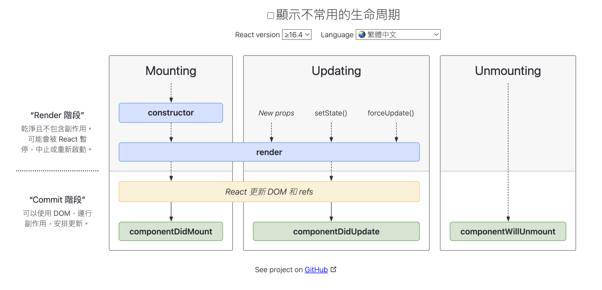

# 生命週期函式

**一個 React 組件在生命各階段會執行的函式**


圖摘自: https://projects.wojtekmaj.pl/

## Render 階段 & Commit 階段

React 框架最主要的作用：
由我們定義資料以及 render 視覺 的方式。
React 核心會負責處理資料到視覺元素的轉換，並在資料變更時更新視覺元素。

和 React 核心不相干的事為副作用，例如：網路上抓資料，繪製 canvas

## 常用生命週期

### constructor 建構函式

組件誕生時，第一個執行的函式

- 裡面一定要呼叫 `super()`，super 為這個 class 的父類別的建構函式
- 傳入 props 作為參數

通常會在 constructor 做的事：

- 指定 this.state
- bind 自訂函式

禁止在 constructor 做的事：

- 使用 `setState`
- 將 props 屬性指定到 state 中
- 呼叫 fetch、 ajax、取得資料、上傳資料

```javascript
constructor(props) {
    // constructor 中的 this 為組件
    super(props);
    this.state = {
        count: 0
    }

    this.handleClick = this.handleClick.bind(this) // 很少這樣寫, 自訂函式改用 Arrow Function
}

// 要記得 bind this
handleClick() {
    // ...
}


handleClick = () =>  {
    // ...
}
```

### render 渲染

讀取 props、state，將資料轉成視覺畫面

不在 render 做的事：

- 呼叫 `setState`，形成無窮迴圈
- 呼叫 fetch、 axios

### componentDidMount

組件第一次 render 到畫面上會執行的函式

常見執行內容：

- fetch 遠端資料，將資料存到 state
- canvas 繪製

### componentDidUpdate

組件 props、state 觸發更新會執行的函式

要記得比較！

```javascript
componentDidUpdate(prevProps, prevState, snapshot) {
    // condition
    if (prevProps.userId !== this.props.userId) {
        this.fetchUser(.....)
    }
}

```

### componentWillUnmount

最常使用情境：

- 頁面離開
- 取消監聽事件
- 取消 ajax
- 取消 timeout、timer

## 其他生命週期

### getDerivedStateFromProps

- 發生在一個組件剛掛載時或是從每次 props、state 的更新時
- 靜態函式，裡面沒有 this 可以用
- 需要回傳新的 state or null
- 很多方式可取代他的用途
- 不能在裡面做非同步的操作

```javascript
static getDerivedStateFromProps(nextProps, prevState) {
    if (nextProps.items !== prevState.items) {
        return {
            items: nextProps.items,
            count: nextProps.items.length
        }
    }
}

```

### shouldComponentUpdate
- 用在控制組件要不要更新的時候
- 吃 nextProps、nextState 兩個參數
- 回傳 boolean，預設回傳 true
- 回傳 false，後續 render、compomentDidUpdate 函式不會執行
- 效能調校重要的函式

### getSnapshotBeforeUpdate
- 實際 DOM 頁面更新之前執行的函式
- 用在比較更新前後的 DOM
